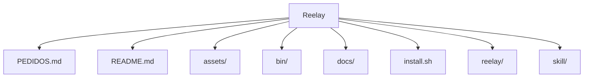

# Estrutura — Reelay

## Pastas de topo

```
Reelay/
├── PEDIDOS.md
├── README.md
├── assets/
├── bin/
├── docs/
├── install.sh
├── reelay/
├── skill/
```

## Diagrama



## Componentes / módulos importantes

_Sem pastas de módulo padrão detectadas._
